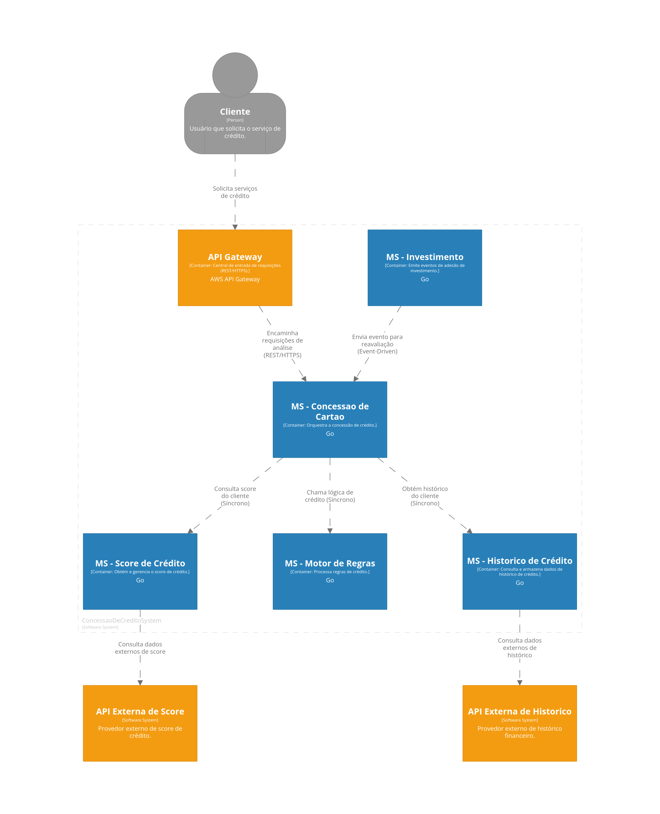

# Documentação Técnica – Sistema de Concessão de Crédito

## Sumário

1. [Introdução](#introdução)  
2. [Contexto do Negócio](#contexto-do-negócio)  
3. [Visão Arquitetural](#visão-arquitetural)  
   1. [Descrição Geral](#descrição-geral)  
   2. [Diagrama de Containers](#diagrama-de-containers)  
   3. [Principais Componentes](#principais-componentes)  
4. [Atributos de Qualidade](#atributos-de-qualidade)  
   1. [Performance (Desempenho)](#performance-desempenho)  
   2. [Escalabilidade](#escalabilidade)  
   3. [Disponibilidade](#disponibilidade)  
   4. [Segurança](#segurança)  
   5. [Observabilidade e Monitoramento](#observabilidade-e-monitoramento)  
5. [Decisões de Implementação](#decisões-de-implementação)  
   1. [Linguagem e Frameworks](#linguagem-e-frameworks)  
   2. [Infraestrutura como Código (IaC)](#infraestrutura-como-código-iac)  
   3. [Padrões de Arquitetura](#padrões-de-arquitetura)  
   4. [Pipelines de CI/CD](#pipelines-de-cicd)  
   5. [Estratégia de Logs e Relatório de Erros](#estratégia-de-logs-e-relatório-de-erros)  
6. [Custos e Pontos de Atenção](#custos-e-pontos-de-atenção)  
7. [Conclusão e Próximos Passos](#conclusão-e-próximos-passos)  
8. [Referências](#referências)

---

## 1. Introdução

Este documento descreve a **arquitetura de software** de um **Sistema de Concessão de Crédito**, contemplando:

- **Objetivos de negócio** (aprovação de limites para clientes).  
- **Design de microserviços** e **API**.  
- **Integrações com serviços externos** (histórico de crédito e score).  
- **Decisões de implementação** (Go, AWS, Terraform, ECS Fargate, JWT).  
- **Estratégias de desempenho, segurança, logs, monitoramento e escalabilidade**.

As escolhas aqui apresentadas foram feitas seguindo as **melhores práticas** de mercado, considerando aspectos de **custo-benefício**, **simplicidade operacional** e **qualidade** (latência, robustez, segurança e escalabilidade).

---

## 2. Contexto do Negócio

A instituição financeira deseja oferecer **limites de crédito** em **tempo real**, com as seguintes necessidades:

- **Latência**: ~200 ms para responder à solicitação de crédito.  
- **Disponibilidade**: SLA de 99,9%.  
- **Recalcular limite** a cada novo investimento do cliente.  
- **Segurança**: Proteção de dados sensíveis e conformidade com normas (LGPD, PCI, etc.).  

É fundamental integrar-se a **APIs de histórico** e **score de crédito** externas. O **case** exige alta **resiliência**, **escalabilidade** (picos de 600 TPS) e **observabilidade** para garantir a confiabilidade do serviço.

---

## 3. Visão Arquitetural

### 3.1 Descrição Geral

- **API Gateway** (AWS API Gateway) como ponto de entrada **REST** (motivação: padrão amplamente adotado, facilita integração e evolução de serviços).  
- **Microserviços em Golang** para cada subdomínio (Concessão de Cartão, Motor de Regras, Histórico, Score, Investimento).  
- **Chamadas Síncronas** (REST/HTTPS) para consultas de histórico e score, e para validação de regras.  
- **Event-driven** para notificar recalcular limite quando ocorre um novo investimento (MS - Investimento emite evento para MS - Concessão de Cartão).

### 3.2 Diagrama de Containers

### 3.3 Principais Componentes

1. **API Gateway**:  
   - Recebe requisições REST/HTTPS, gerenciando autenticação via **JWT** e rate limiting.  
   - **Motivação**: Permite padronizar entrada de requisições, facilita rotear para cada microserviço e aplicar proteções (DDoS, throttling).  

2. **MS - Concessao de Cartao (Go)**:  
   - Orquestra todo o fluxo de aprovação, chamando o **Motor de Regras** e consultando **Histórico** e **Score** do cliente.  
   - **Motivação**: Centraliza a decisão final de crédito, mas segue leve e focada, delegando lógica de negócio ao `Motor de Regras`.  

3. **MS - Motor de Regras (Go)**:  
   - Armazena as políticas de crédito (parâmetros de risco, pontuações mínimas, etc.).  
   - Pode ser atualizado com frequência sem impactar outros serviços.  
   - **Motivação**: Facilita manutenção, governança de regras e escalabilidade independente.  

4. **MS - Historico de Crédito (Go)**:  
   - Conecta-se a APIs externas de histórico de inadimplência, devoluções, contratos.  
   - Pode manter um cache local ou em Redis para evitar consultas repetidas.  
   - **Motivação**: Isolar a complexidade de integrações externas (bureaus) e não sobrecarregar o orquestrador (Concessão de Cartão).  

5. **MS - Score de Crédito (Go)**:  
   - Integra-se a bureaus externos (Serasa, BoaVista, etc.).  
   - Também utiliza estratégias de caching e fallback em caso de indisponibilidade externa.  
   - **Motivação**: Mesmo princípio de isolamento — foco em um domínio claro (obter e gerenciar score).  

6. **MS - Investimento (Go)**:  
   - Emite eventos sempre que há adesão de investimento, acionando reanálises de crédito.  
   - **Motivação**: Garantir reavaliação automática e desacoplada do fluxo principal.  

7. **APIs Externas (Histórico/Score)**:  
   - Sistemas de terceiros que retornam dados financeiros.  

---

## 4. Atributos de Qualidade

### 4.1 Performance (Desempenho)

- **Golang**: Binários leves, inicialização rápida e overhead de memória reduzido.  
- **Paralelismo**: Chamadas a serviços de **Histórico** e **Score** podem acontecer em goroutines simultâneas, diminuindo latência.  
- **Caching**: Redis/ElastiCache para armazenar dados de score/histórico.  
- **Picos**: Planejar para 600 TPS em cenários de pico, garantindo dimensionamento automático (autoscaling).

### 4.2 Escalabilidade

- **Auto Scaling**: 
  - **AWS ECS Fargate** (motivação: simplifica gestão de contêineres, não exige provisioning de nós) ajusta horizontalmente contêineres conforme CPU/RAM/latência.  
- **Event-driven**: Uso de fila/tópico (SQS, SNS) para processar picos de mensagens (investimentos, disparando reanálises).  
- **Database per Service**: Cada microserviço tem seu próprio armazenamento, evitando contenção num único banco monolítico.

### 4.3 Disponibilidade

- **SLA 99,9%**: ECS Fargate com réplicas em múltiplas zonas de disponibilidade (AZs).  
- **Circuit Breaker**: Se APIs externas estiverem indisponíveis ou lentas, usar fallback e evitar saturar o sistema de chamadas.  
- **Retries**: Retentativas com backoff exponencial em caso de falhas transitórias.

### 4.4 Segurança

- **JWT** (motivação: permite token stateless, escalável, e padronizado na indústria).  
- **API Gateway**: Verifica validade do token JWT e aplica rate limiting.  
- **Segredos**: Armazenados no AWS Secrets Manager (motivação: segura, nativa da AWS).  
- **Criptografia em repouso**: Banco RDS (PostgreSQL ou DynamoDB) com KMS (chaves gerenciadas pela AWS).  
- **Auditoria**: Logging de cada análise de crédito, com correlação de requisições (trace_id).

### 4.5 Observabilidade e Monitoramento

- **Logs Estruturados**: Em JSON, enviados para CloudWatch (simplifica correlação com métricas).  
- **Métricas**: Coletadas via CloudWatch (CPU, memória, TPS, latência), com dashboards integrados ao **Amazon Managed Grafana**.  
- **Tracing Distribuído**: AWS X-Ray para rastrear requisições entre microserviços.  
- **Alertas**: Configurados no CloudWatch Alarms e Grafana Alerts (ex.: Slack, e-mail).  

---

## 5. Decisões de Implementação

### 5.1 Linguagem e Frameworks

- **Golang**:  
  - **Motivação**: Excelente performance, binários leves, concorrência simplificada (goroutines) e inicia rapidamente, mantendo latência baixa em cenários de auto scaling.  
- **Framework net/http** (ou Gin):  
  - **Motivação**: net/http nativo é minimalista, confiável e com boa performance; Gin oferece roteamento e middlewares prontos, reduzindo trabalho repetitivo.  
- **Resiliência**:  
  - **Motivação**: Evitar falhas cascatas e melhorar robustez. Usar bibliotecas como [gobreaker](https://github.com/sony/gobreaker) para circuit breaker e retry/backoff em integrações externas.

### 5.2 Infraestrutura como Código (IaC)

- **Terraform**:  
  - **Motivação**: É um padrão de mercado para IaC, provê consistência e versionamento de todo stack AWS (VPC, Subnets, ECS Fargate, RDS, etc.).  
  - Pipelines de “plan” e “apply” para validar e aprovar mudanças.

### 5.3 Padrões de Arquitetura

- **Microserviços**:  
  - **Motivação**: Favorece autonomia de times, escalabilidade seletiva e desacoplamento.  
- **Event-driven**:  
  - **Motivação**: Assegurar que cada novo investimento seja processado sem bloquear a solicitação do cliente, garantindo flexibilidade para picos de tráfego.  
- **CQRS** (opcional):  
  - **Motivação**: Em casos de altas leituras x poucas escritas, separar repositórios/handlers pode melhorar desempenho e simplicidade de consultas.

### 5.4 Pipelines de CI/CD

- **GitHub Actions** (ou Jenkins):  
  - **Motivação**: Integra-se facilmente ao repositório GitHub, executa testes (unit/integration), gera imagens Docker e faz push para ECR.  
- **Deploy Contínuo**: ECS Fargate com **Blue/Green** ou **Rolling Update**:  
  - **Motivação**: Minimiza downtime, validando a nova versão antes de receber tráfego.  
- **Testes**:  
  - **Motivação**: Garantir qualidade e segurança do release, usando testes de carga (K6/Locust), e scanners de segurança (GoSec).

### 5.5 Estratégia de Logs e Relatório de Erros

1. **Logs Estruturados**  
   - Formato JSON com `timestamp`, `level`, `trace_id`, `service_name`, etc.  
   - **Motivação**: Facilita indexação e correlação, permite alertas acionáveis.

2. **Coleta de Logs**  
   - **CloudWatch Logs**: Integrado nativamente com ECS Fargate.  
   - **Motivação**: Simplicidade operacional, não sendo necessário gerenciar infraestrutura de log adicional.

3. **Monitoramento em Tempo Real**  
   - **Amazon Managed Grafana** vinculado ao CloudWatch.  
   - **Motivação**: Dashboards prontos para métricas de CPU, latência, erro etc., sem overhead de instalação de Grafana manual.

4. **Alertas e Notificações**  
   - **CloudWatch Alarms** + Slack/e-mail.  
   - **Motivação**: Receber alertas instantâneos para resolução de incidentes.

5. **Relatório de Erros e Exceções**  
   - **Sentry** (ou outro) para agrupar stack traces e priorizar falhas.  
   - **Motivação**: Identificar rapidamente erros sistêmicos, rastrear tendências de falhas e tempo para resolução.

6. **Tracing Distribuído**  
   - **AWS X-Ray**:  
     - **Motivação**: Correlação nativa com serviços AWS, reduz complexidade de setup.  
   - Permite depurar gargalos e tempo de resposta entre microserviços.

---

## 6. Custos e Pontos de Atenção

1. **Custos AWS**  
   - **Fargate** elimina a gestão de EC2, mas pode custar mais em cargas estáveis de longo prazo.  
   - Observabilidade (CloudWatch, Grafana) gera custos proporcionais ao volume de logs e retenção.  
   - **Mitigação**: Monitorar uso real, optar por Reserved Instances ou Savings Plans se for previsível.

2. **Complexidade Microserviços**  
   - Exige pipelines de CI/CD bem estruturados, logging e tracing distribuídos.  
   - **Mitigação**: Time DevOps/SRE dedicado, automação de testes, boas práticas de versionamento.

3. **Trade-offs**  
   - **Go x Java/Kotlin**: Go é mais enxuto para microserviços de alta performance, mas Java/Kotlin tem ecossistema amplo.  
   - **ECS x EKS**: Escolhemos ECS Fargate pela facilidade de adoção e menor curva de aprendizado comparado ao Kubernetes gerenciado.

4. **Conformidade Regulamentar**  
   - **LGPD/PCI**: Criptografia em repouso (KMS), logs sem dados sensíveis, controlando acesso via IAM.  
   - Necessário **acompanhamento legal** e auditorias periódicas.

---

## 7. Referências

- **Microservices Patterns (Chris Richardson)**: [https://microservices.io/patterns](https://microservices.io/patterns)  
- **AWS Well-Architected Framework**: [https://aws.amazon.com/architecture/well-architected/](https://aws.amazon.com/architecture/well-architected/)  
- **Grafana**: [https://grafana.com/](https://grafana.com/)  
- **GoSec** (Análise de Segurança em Go): [https://github.com/securego/gosec](https://github.com/securego/gosec)  
- **Structurizr**: [https://structurizr.com/](https://structurizr.com/)  
- **Terraform**: [https://www.terraform.io/](https://www.terraform.io/)  
- **Sentry** (Monitoramento de Erros): [https://sentry.io/](https://sentry.io/)  
